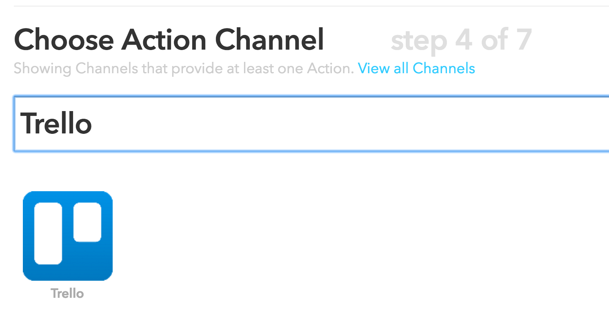
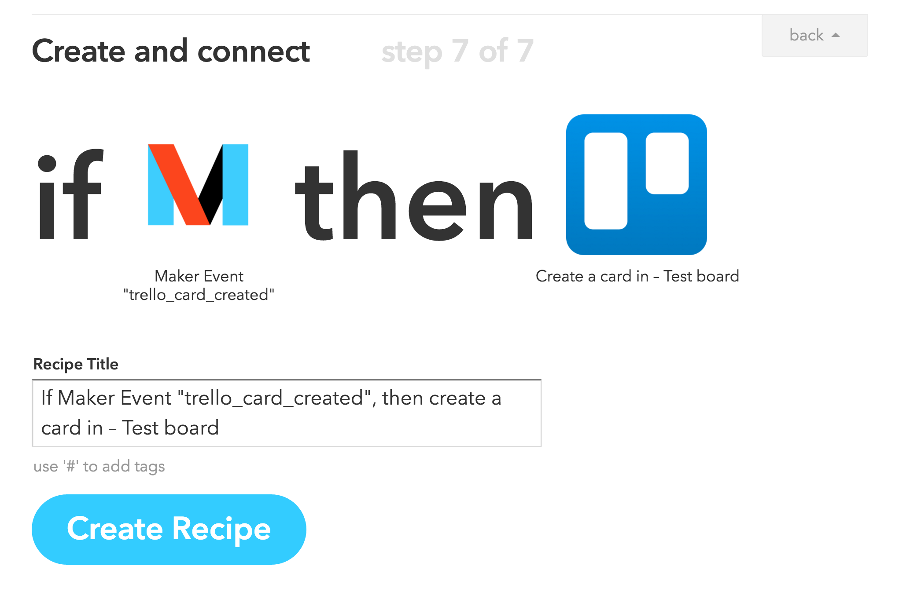

# Annyang-Trello-Hack
This is part of a hack to create trello cards using the voice recognition library [Annyang](https://github.com/TalAter/annyang).  The hack consists of two parts.

1. This project, a [webtask](https://webtask.io) which serves up a FORM for filling out the trello card details via voice recognition and then makes requests to an IFTTT channel.
2. A user created [IFTTT channel](https://ifttt.com) which receives requests from the webtask and creates trello cards.

## Deploying the hack
First we must create the appropriate IFTTT channel.  Then we must deploy the webtask.

#### Creating the IFTTT channel

1. Go to https://ifttt.com/myrecipes/personal/new


1. Click on `this` and select the Maker channel


1. Choose the trigger `Receive a Web Request`
1. Call the event `trello_card_created`


1. Click on `that` and select the Trello channel




1. Choose the action `Create a card`


1. Fill out the information for creating the card.  
"Value1", "Value2", "Value3" will contain the list name, card title, and card description respectively.  Here is an example of what to enter:


1. Create the recipe



#### Getting your Maker key
In order to use the Maker channel you will need your Maker channel key.  Go to the https://ifttt.com/maker to retrieve it.

#### Deploying the webtask

1. Clone the project and cd into it
```
git clone https://github.com/mosoto/annyang-trello-hack
cd annyang-trello-hack/
```
1. Install the webtask cli
```
npm install wt-cli -g
wt init
```
1. Deploy the web task
```
wt create app.js --no-parse --no-merge --secret MAKER_KEY="[Your maker key]"
```

## Using the hack

Once the web task is deployed, you can navigate to the webtask url using Chrome and start using it.  
*Other browsers, may or may not work.  It depends on their support of the speech recognition APIs.*

The task will look like the following:


Assuming you have a good microphone and an sufficiently quiet room, speaking `list home` should set the list name input field to `home`.  The same goes for `title my title` and `description This is the description`.  Saying `submit` should automatically click on the `Submit` button which will then create your trello card.
